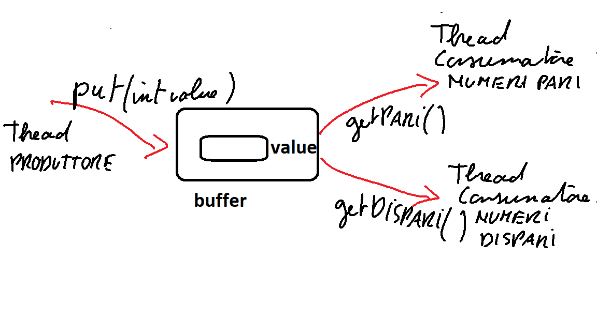

# Esempio Produttore/Consumatore numeri pari e dispari

Un produttore inserisce dei numeri random in un buffer a una sola
posizione. Due thread hanno il compito di svuotare il buffer (consumatori): uno 
preleva solo nel caso nel buffer ci sia un numero pari e l'altro
solo se nel buffer c'è un numero dispari.

La classe [Buffer](./src/Buffer.java), l'[App](./src/App.java) il programma, il thread
[Produttore](./src/Produttore.java) di numeri random e i due thread consumatori
[ConsumatorePari](./src/ConsumatorePari.java), [ConsumatoreDispari](./ConsumatoreDispari.java).
